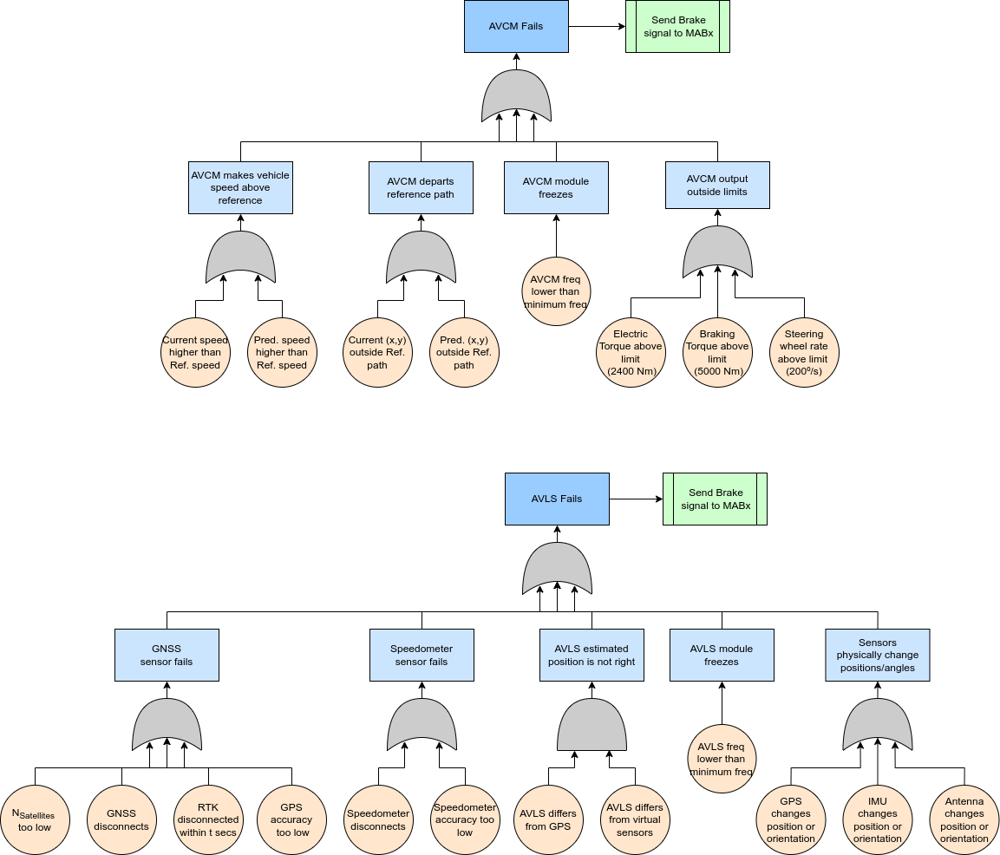
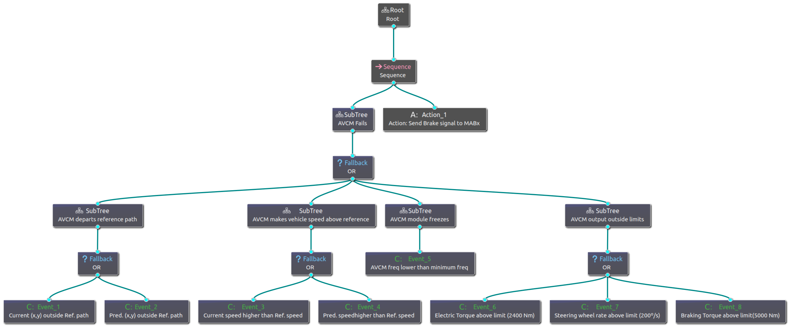
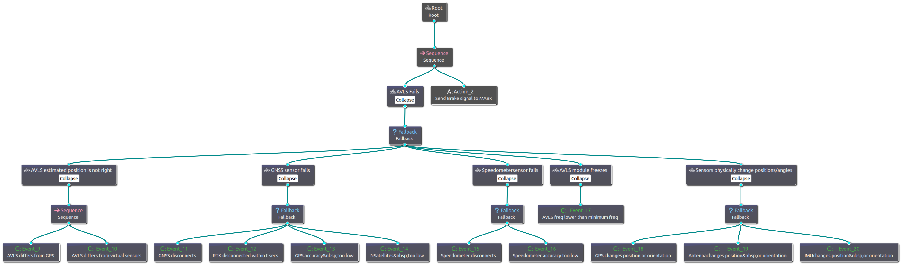

# Fault Tree to Behavior Tree Converter

## Overview
This project focuses on the conversion of fault trees, represented in draw.io diagram XML files, into behavior tree XML files compatible with the BehaviorTree.CPP library. It enables users to transform their fault tree diagrams into actionable behavior trees, facilitating integration with systems that utilize the BehaviorTree.CPP framework for managing complex behaviors.

## Installation
1. Clone the repository to your local machine.
2. Ensure you have Python installed.
3. Install the required dependencies by running the following command in the project directory.
```bash
git clone git@github.com:cconejob/trees.git
cd trees
pip install -r requirements.txt
```

## Usage
The tool is designed to convert fault trees from draw.io diagram XML files into behavior tree XML files compatible with the BehaviorTree.CPP library. Here's how to use it:

### Preparing Your Fault Tree Diagram

1. **Create or Open Your Fault Tree Diagram in Draw.io**:
    * First, visit [draw.io](https://draw.io/) to create or edit your fault tree diagram. You may refer to their [documentation](https://www.drawio.com/doc/) for guidance on using the tool.
2. **Diagram Structure & Symbols**:
    * **Hazards**: Represent hazards using rectangles. This is a required element in your diagram.
    * **Events**: Depict events using circles. These are also required elements.
    * **Actions**: Actions can be represented by processes. Including actions is optional but helpful to clarify how the hazard should be handled.
    * **AND/OR Gates**: Use the respective symbols for AND/OR gates in your diagram. These are required for depicting logical relationships in the fault tree.
3. **Exporting the Diagram as XML**:
    * Once your fault tree diagram is ready, you need to export it in XML format. In draw.io, go to `File` > `Export as` > `XML` to save your diagram as an XML file.
4. **Save the XML File in the `/fault_trees` Folder**:
    * After exporting your diagram as an XML file, save it in the `/fault_trees` folder within the project directory.

### Input Example: Fault Tree Diagram

Below is an example of two fault tree diagrams generated in the same Draw.io file:



### Running the Conversion Tool

1. Ensure you have the required XML file from draw.io in the /fault_trees folder.
2. Open a terminal or command prompt and navigate to the project directory.
3. Run the conversion command:

    ```bash
    python3 scripts/ft2bt.py -f <xml_filename> [-r] [-v]
    ```

Where:

* **-f**: (Required) Specifies the XML filename of the draw.io diagram.
* **-r**: (Optional) Enables renderization of the output. Defaults to false.
* **-v**: (Optional) Automatically shows the renders if renderization (**-r**) is true. Defaults to false.

### Output Example: Behavior Tree Diagram

Below is an example of the behavior tree diagrams generated from the two fault trees. The XML file is loaded using [Groot](https://github.com/BehaviorTree/Groot):

The first behavior tree is represented below:

The second behavior tree is shown below:

